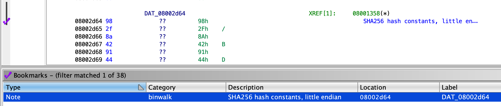
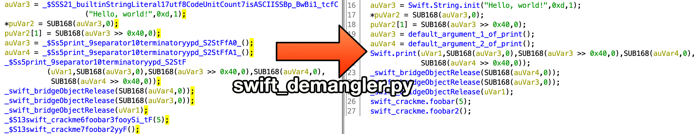
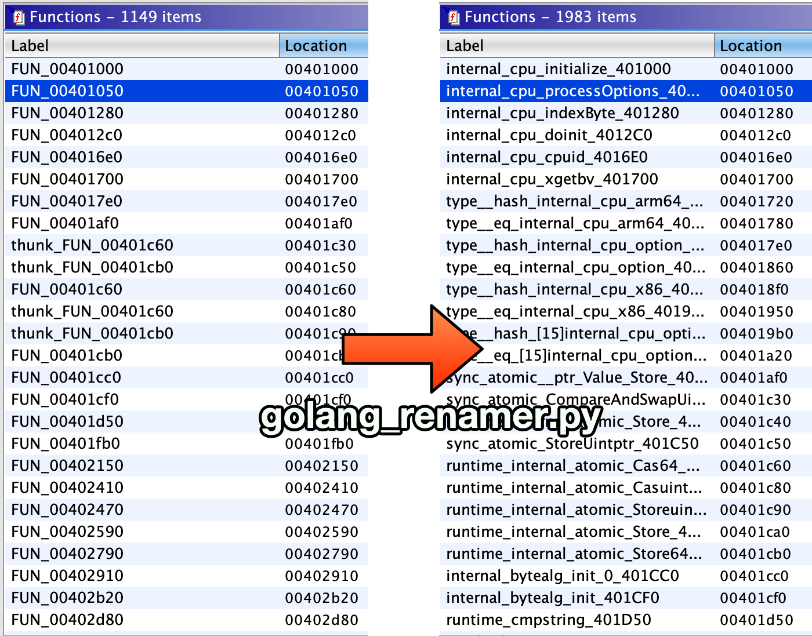

# ghidra_scripts
Scripts for the Ghidra software reverse engineering suite.

## Installation

In the Ghidra Script Manager click the "Script Directories" icon in the toolbar and add the checked out repository as a path. Scripts from this collection will appear in the "Ghidra Ninja" category.

## binwalk.py

Runs binwalk on the current program and bookmarks the findings. Requires binwalk to be in `$PATH`.

## yara.py

Automatically find crypto constants in the loaded program - allows to very quickly identify crypto code.

Runs yara with the patterns found in yara-crypto.yar on the current program. The Yara rules are licensed under GPLv2. In addition @phoul's SHA256 rule was added.

Requires `yara` to be in `$PATH`.

## export_gameboy_rom.py

Exports working ROMs from ROMs imported using Gekkio's [GhidraBoy](https://github.com/Gekkio/GhidraBoy).

## swift_demangler.py

Automatically demangle swift function names. For more complex functions it adds the full demangled name into the function comment. Requires `swift` to be in `$PATH`.

## golang_renamer.py

Restores function names from a stripped Go binary. This script was contributed by QwErTy (QwErTyReverse on Telegram) and is a port of George Zaytsev's go_renamer.py.

